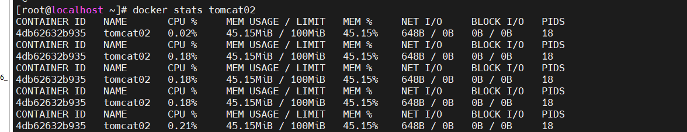
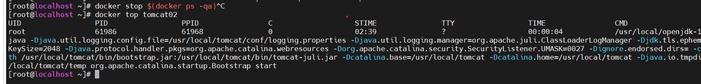

## 运行容器： 
例子1：
`docker run -d --name tomcat02 --memory 100M --cpu-shares 10 -p 9090:8080 tomcat:8
`
### 指定内存
`--memory 100M`
### 指定cpu占比
`--cpu-share 10`

## 关闭所有的容器
`docker stop $(docker ps -qa)`

## 查看容器资源

### 查看容器系统占用情况
`docker stats 容器id或容器名`

`docker top 容器id或容器名`

### 实用weavescope图形化监控容器
https://blog.csdn.net/baidu_21349635/article/details/120406629?csdn_share_tail=%7B%22type%22%3A%22blog%22%2C%22rType%22%3A%22article%22%2C%22rId%22%3A%22120406629%22%2C%22source%22%3A%22baidu_21349635%22%7D&ctrtid=lTUzA