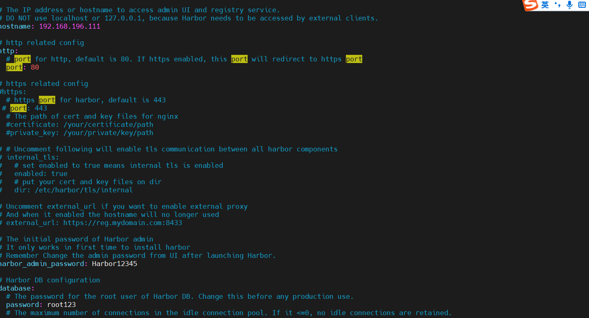
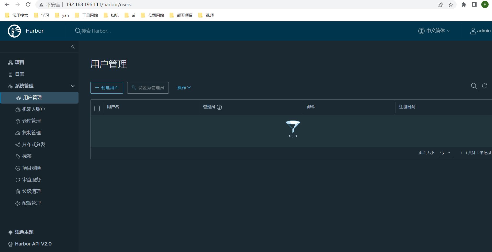
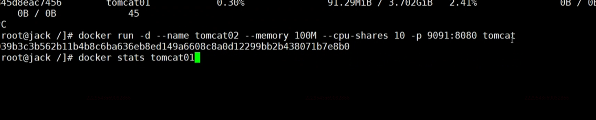

# docker-habor安装教程

## 前提： 安装docker-compose 因为harbor依赖于docker-compose ; harbor2版本要求: docker-compose1.8+

```SHELL
curl -L https://github.com/docker/compose/releases/download/1.27.2/docker-compose-`uname -s`-`uname -m` -o /usr/local/bin/docker-compose
```

```SHELL
chmod +x /usr/local/bin/docker-compose
```

```SHELL
docker-compose --version
```

## 1.下载gz包
github地址: https://github.com/goharbor/harbor/releases


## 2.修改 harbor.yml.tmpl 重命名为  harbor.yml

- 关闭https相关信息
- hostname改为自己的ip虚拟机地址

## 3. ./install.sh

## 4.页面访问 http://ip:80
`默认账户  admin / Harbor12345`
<br/>
进入页面后的效果图



## 小技巧：指定内存大小和cpu占比


